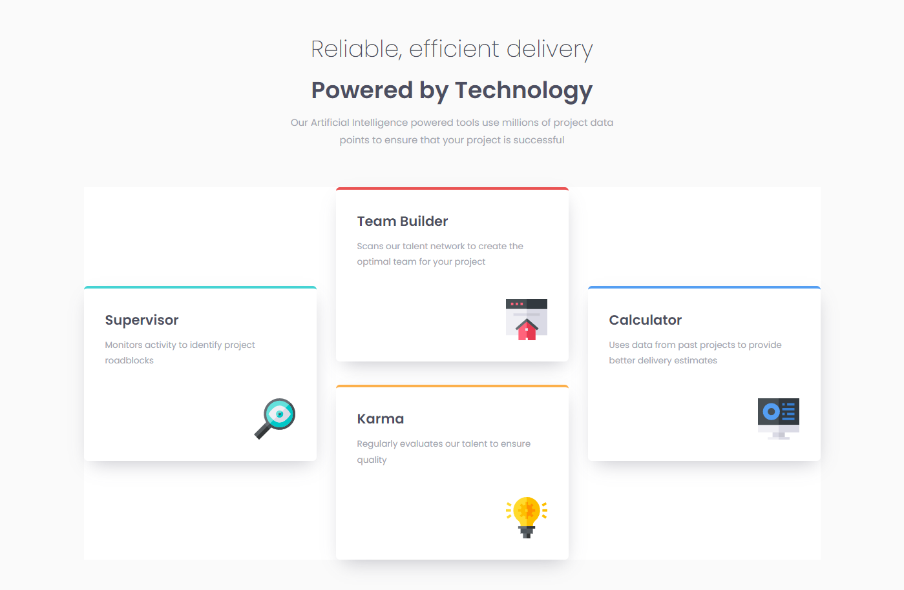

# Frontend Mentor - Four card feature section solution

This is a solution to the [Four card feature section challenge on Frontend Mentor](https://www.frontendmentor.io/challenges/four-card-feature-section-weK1eFYK). Frontend Mentor challenges help you improve your coding skills by building realistic projects.

## Table of contents

- [Overview](#overview)
  - [The challenge](#the-challenge)
  - [Screenshot](#screenshot)
  - [Links](#links)
- [My process](#my-process)
  - [Built with](#built-with)
  - [What I learned](#what-i-learned)
- [Author](#author)

## Overview

### The challenge

Users should be able to:

- View the optimal layout for the site depending on their device's screen size

### Screenshot

### Links

[Solution URL](https://github.com/Antonvasilache/product-preview-card)
[Live Site URL](https://product-preview-card-av.netlify.app/)

## My process

1. Writing down the HTML structure and adding the content inside.
2. Adding css classes.
3. Formatting the header section as per the design.
4. Adding additional flex and grid containers to space the elements accordingly.
5. Adding all the design elements to the cards.
6. Adjusting the cards spacing as per the design.
7. Adding breakpoints for mobile design.

### Built with

- Semantic HTML5 markup
- CSS custom properties
- Flexbox
- CSS Grid

### What I learned

- Creating complex layouts with multiple grids and flexboxes.

## Author

- Website - [Antonvasilache.com](https://www.antonvasilache.com)
- Frontend Mentor - [@Antonvasilache](https://www.frontendmentor.io/profile/Antonvasilache)
